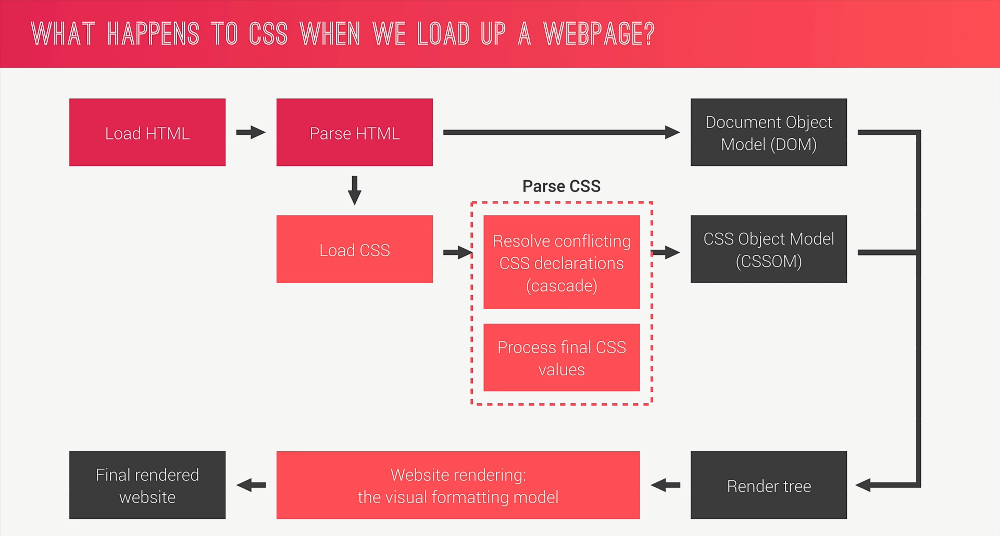
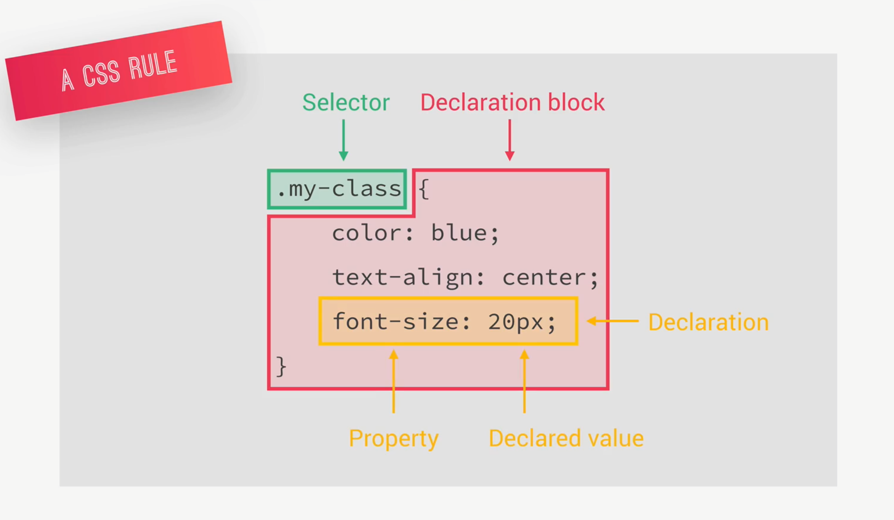
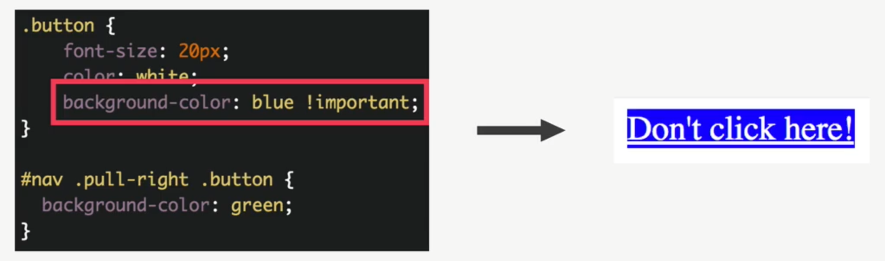
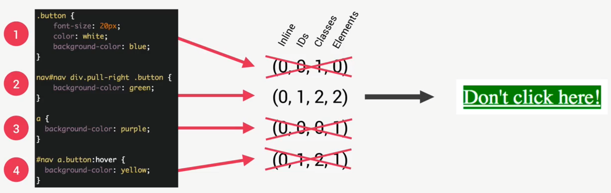
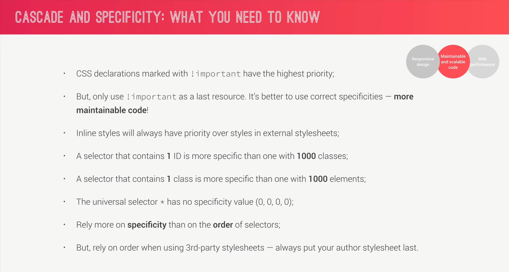
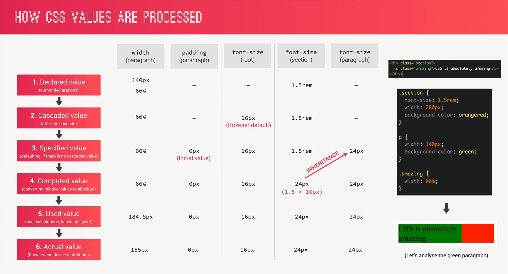
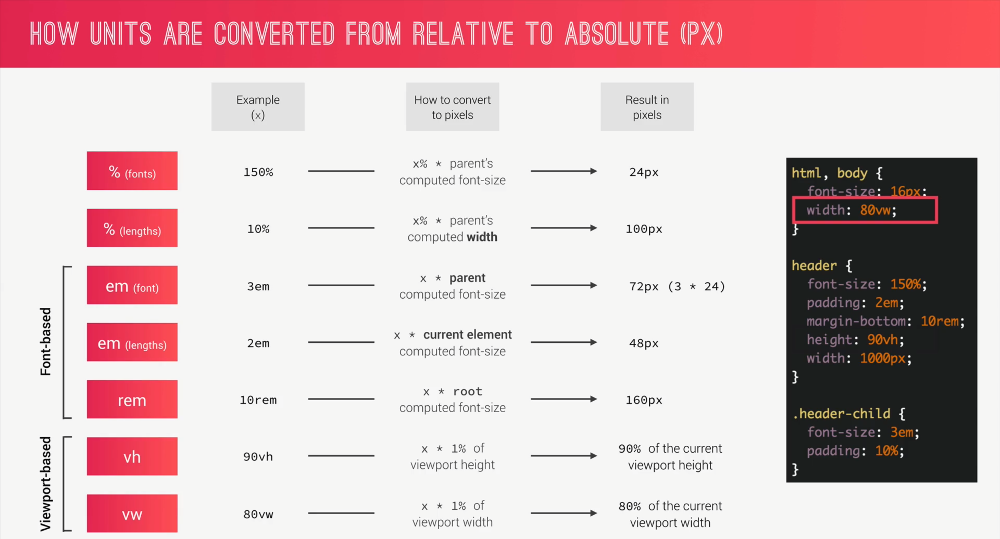
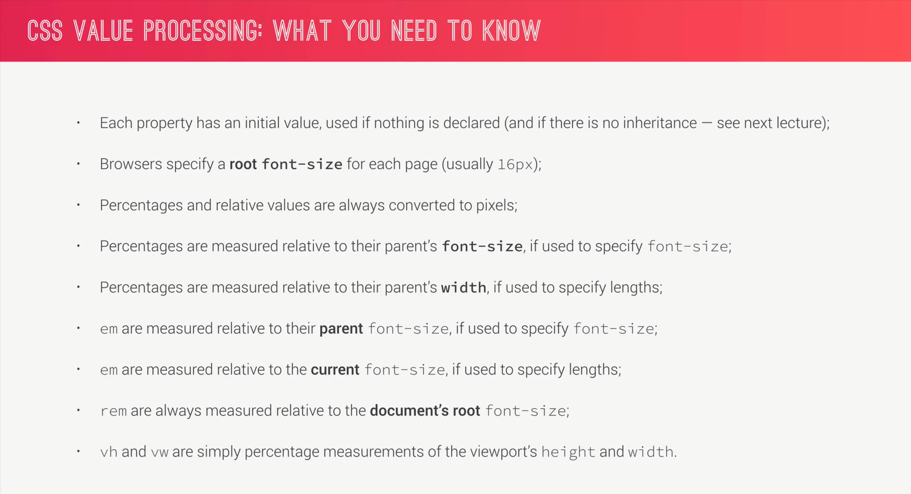
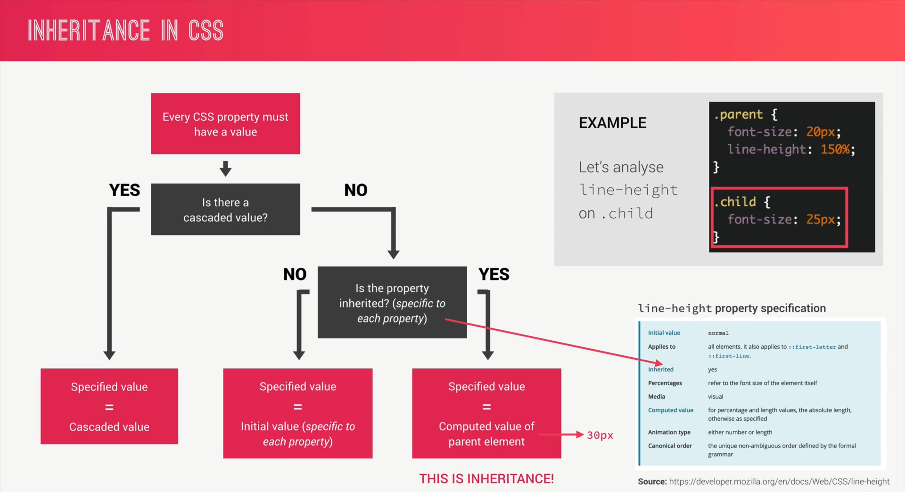
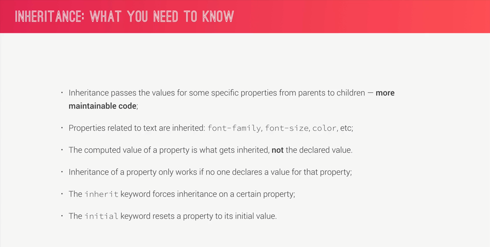

## CSS全局声明*与body的区别
- body有继承性
```css
举个例子就明白了：
<h1>标签默认的字体大小为"font-size: 2em;"，如果用:
* {
    font-size:20px;
}
声明全局样式，则<h1>标签的字体大小会更改为"font-size: 20px;"；而如果用:
body {
    font-size:20px;
}
声明全局样式，则<h1>标签的字体大小仍为"font-size:2em;"，只是计算由原来浏览器的默认字体大小16px × 2 = 32px更改为20px × 2 = 40px；
```

# How CSS Works: A Look Behind the Scenes

## 1. Three Pillars of Writing Good HTML and CSS (Never Forget Them)

### 1.1 Resposive Design
- Fluid layouts
- Media queries
- Responsive images
- Correct units
- Desktop-first vs mobile-first

### 1.2 Maintainable and scalable code
- Clean
- Easy-to-understand
- Growth
- Reusable
- How to organize files
- How to name classed
- How to structure HTML

### 1.3 Web Performance
- Less HTTP requests
- Less code
- Compress code
- Use a CSS preprocessor
- Less images
- Compress images

## 2. How CSS Works Behind the Scenes: An Overview



## 3. How CSS is Parsed. 

### 3.1 How CSS is Parsed - The Cascade and Specificity



eg. 
eg. 


### 3.2 How CSS is Parsed - Value Processing





### 3.3 How CSS is Parsed - Inheritance

