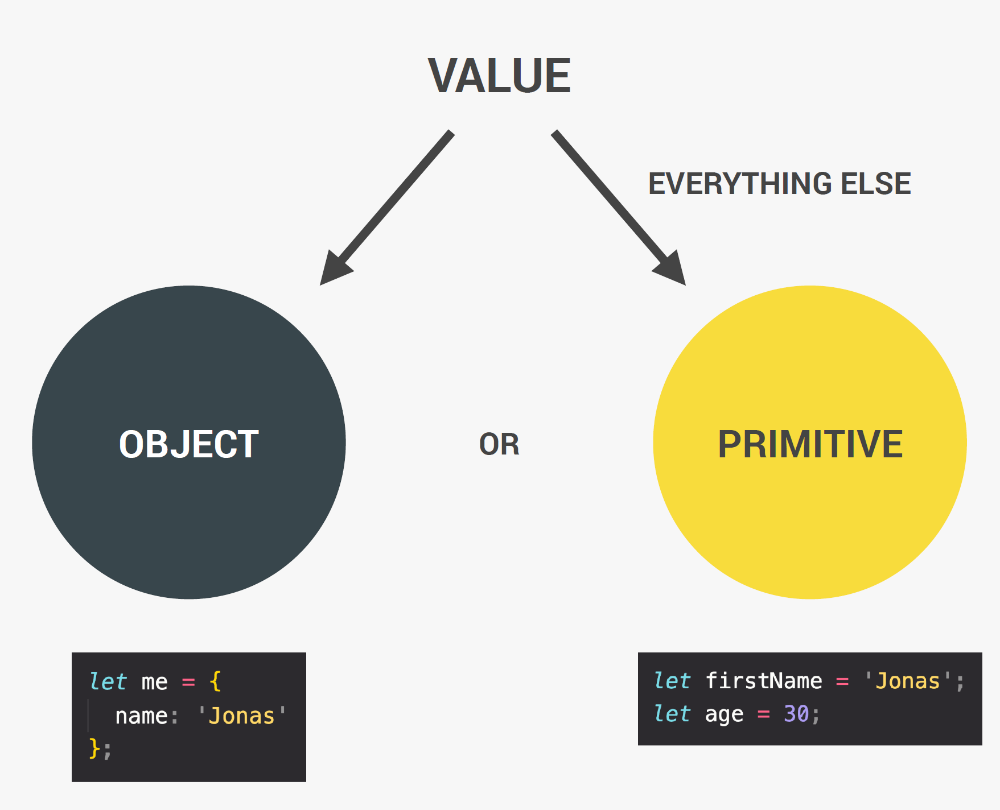
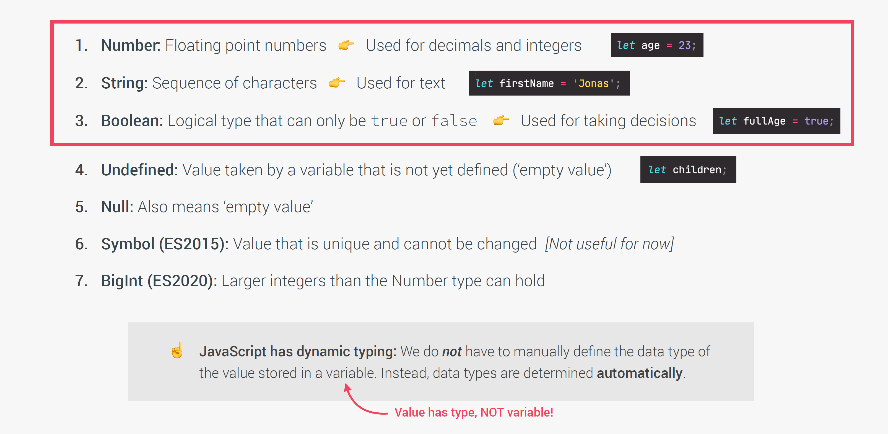
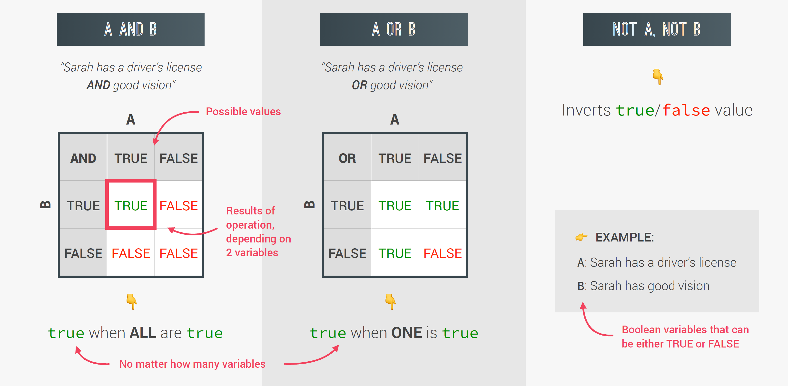

# JAVASCRIPT FUNDAMENTALS
## A BRIEF INTRODUCTION TO JAVASCRIPT
### Rules for Naming Variables
- Variable names can only contain numbers, letters, underscores, or the dollar sign.
- JavaScript has only a few rules for variable names:
- The first character must be a letter, an underscore (_) or a dollar sign($). You can't use a number as the first character.
- The rest of the variable name can include any letter, any number, or the underscore. You can't use any other characters, including spaces, symbols, and punctuation marks.
- As with the rest of JavaScript, variable names are case sensitive. That is, a variable named Interest_Rate is treated as an entirely different variable than one named interest_rate.
- There's no limit to the length of the variable name.
- You can't use one of JavaScript's reserved words as a variable name. 
- We should not start a variable name with an uppercase letter, because variable name with an uppercase letter for a specific use case in JS, which is object-oriented programming.
- Variables that are all in uppercase are reserved for constants that we know will never change.```(eg. let PI = 3.1415;)```

## DATA TYPES
### Objects and Primitives

### The 7 Primitive Data Types 


## Basic Operator
- Math operators: +, -, *, / , **(exponentiation)
```javascript
// 2 ** 3 means 2 to the power of 3 = 2 * 2 * 2
```
- Assignment operators: (=), (+=), (-=), (*=), (/=), (++), (--)
- Comparison operators: >, <, >=, <=

### Operator Precedence

## Strings and Template Literals (Template Strings)
backticks``
```js
console.log('String with \n\
multiple \n\
lines');
console.log(`String with
multiple
lines`);
```
```javascript
const firstName = 'Ben';
const job = 'designer';
const birthYear = 1986;
const year = 2022;
const ben = "I'm " + firstName + ', a ' + (year - birthYear) + ' years old ' + job + '!';
console.log(ben);
console.log(`I'm ${firstName}, a ${year - birthYear} years old ${job}!`)
```
## Taking decisions: if / else Statements
emoji: win+.  😂

## Type Conversion and Coercion
- Type Conversion is when we manually convert from one type to another.
- Type Coercion is when JavaScript automatically converts types behind the scenes for us.
```javascript
console.log('I am ' + 23 + ' years old.') // I am 23 years old.
// the plus operator triggers a coercion to strings. Whenever there is a operator between a string and a number, the number will be converted to a string.
```
```javascript
console.log('10' - 3); // 7
console.log('23' + 7); // 237
console.log('23' + '10' - 3); // 2307
```
## Truthy and Falsy Values
- In JavaScript, there are only five falsy values: 0, '', undefined, null, NaN
```javascript
console.log(Boolean(0));
console.log(Boolean(undefined));
console.log(Boolean('Ben'));
console.log(Boolean({}));
console.log(Boolean(''));
```
- Another use case for the truthy and falsy values is to check if a variable is actually defined or not.
```javascript
let height;
if (height) {
    console.log('YAY! Height is defined');
} else {
    console.log('Height is UNDEFINED')
}
// Height is UNDEFINED
```

## Equality Operators: == VS. ===
- loose equality operator (==) does type coercion
- strict equality operator (===) does not perform type coercion, so it only returns to when both values are exactly the same.

## Boolean Logic
### Basic Boolean Logic: The and, or & not operators


## Logic Operators

## The Switch Statement
```javascript
switch (expression) {
  case value1:
    //Statements executed when the
    //result of expression matches value1
    [break;]
  case value2:
    //Statements executed when the
    //result of expression matches value2
    [break;]
  ...
  case valueN:
    //Statements executed when the
    //result of expression matches valueN
    [break;]
  [default:
    //Statements executed when none of
    //the values match the value of the expression
    [break;]]
}
```
## Statement and Expressions
- statement: a big piece of code that is executed and which does not produce a value on itself.
```javascript
if (23 > 10) {
    const str = '23 is bigger';
} // this is a statement
```
- expression: a piece of code that produces a value.
```javascript
'23 is bigger' // this is an expression
```
- in a template literal, we can only insert expressions, but not statements.

## The Conditional (Ternary) Operator
- the conditional operator allows us to write something similar to an if/else statement but all in one line. 
- the conditional operator is also called ternary operator because it has three parts. Unlike other operators.
```javascript
condition ? exprIfTrue : exprIfFalse
```
- the conditional operator is an expression, not a statement, it has a value, so it can be used in the template literal.
```javascript
const age = 15;
const drink = age >= 18 ? 'wine 🍷' : 'water 💧';
console.log(drink);
```
```javascript
const age = 15;
console.log(`I like to drink ${age >= 18 ? 'wine 🍷' : 'w203.+ater 💧'}`);
```
```javascript
const bill = 40;
const tip = bill >= 50 && bill <= 300 ? bill * 0.15 : bill * 0.2;
console.log(tip);
console.log(`The bill was ${bill}, the tip was ${tip}, and the total value ${bill + tip}`)
```

## JavaScript Releases: ES5, ES6+ and ESNext

## Activating Strict Mode
- Strict Mode is a special mode that we can active in JavaScript, which makes it easier for us to write a secure JavaScript code.
- All we have to do to activate strict mode is to write this ring at the beginning of the script:
```json
'use strict'; 
```
- Always just put strict mode in the beginning of your scripts and like that write more secure code.

## Functions
- Function is simply a piece of code that we can reuse over and over again in our code.

```javascript
function logger() {
    console.log('My name is Ben');
}

// calling / running / invoking function:
logger();
logger();
```
```javascript
function fruitProcessor(apples, oranges) {
    const juice = `Juice wit ${apples} apples and ${oranges} oranges.
 `
    return juice;
}

const appleJuice = fruitProcessor(5, 0);
console.log(appleJuice);

const appleOrangeJuice = fruitProcessor(2, 4);
console.log(appleOrangeJuice);
```

## Function Declarations VS. Expressions
```javascript

// Function declaration
function calcAge1(birthYeah) {
    return 2037 - birthYeah;
}

const age1 = calcAge1(1991);
console.log(age1);

// Function expression
const calcAge2 = function (birthYear) {
    // anonymous function (a function without a name)
    return 2037 - birthYear;
}
const age2 = calcAge2(1991);
console.log(age1, age2);
```

## Arrow Function
```javascript
const yearsUntilRetirement = (birthYear, firstName) => {
    const age = 2022 - birthYear;
    const retirement = 65 - age;
    // return retirement;
    return `${firstName} retires in ${retirement} years`;
}

console.log(yearsUntilRetirement(1988, 'Ben'));
console.log(yearsUntilRetirement(1995, 'Jiali'));
```
## Functions Calling Other Functions

