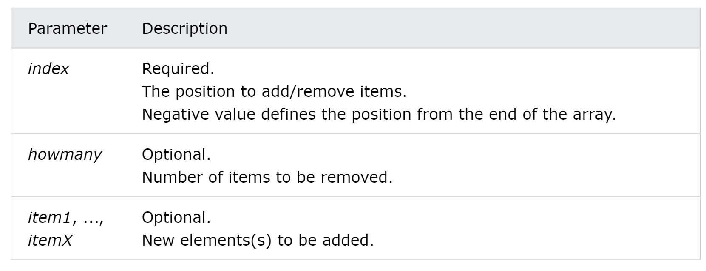

> Let’s create an array:
```javascript
const arr = [1, 2, 3];
const arr2 = [7, 8, 9];
```
> 1. **arr.push()**
> adds one or more elements to the end of an array.
> **Return value**: the new length of the array.
```javascript
console.log(arr.push(5)); // 4
console.log(arr); // [1, 2, 3, 5]
```
> 2. **arr.pop()**
> removes the last element from an array and returns that element. 
> **Return value**: the removed element from the array; undefined if the array is empty.
```javascript
console.log(arr.pop()); // 3
console.log(arr); // [1, 2]
```
> 3. **arr.unshift()**
> adds one or more elements to the beginning of an array.
> **Return value**: the new length of the array.
```javascript
console.log(arr.unshift(0)); // 4
console.log(arr); // [0, 1, 2, 3]
```
> 4. **arr.shift()**
> removes the first element from an array.
> **Return value**: the removed element from the array; undefined if the array is empty.
```javascript
console.log(arr.unshift(0)); // 4
console.log(arr); // [0, 1, 2, 3]
```
> 5. **arr.reverse()**
> reverses an array in place.
> ==overwrites the original array.==
> **Return value**: the array after it has been reversed.
```javascript
console.log(arr.reverse()); // [3, 2, 1]
console.log(arr); // [3, 2, 1]
```
> 6. **arr.slice()**
> Selects a part of an array, and returns the new array.
> selects from a given start, up to a (*not inclusive*) given end.
> ==does not change the original array.==
> **Return value**: a new array containing the selected elements.
```javascript
console.log(arr.slice(0, 2)); // [1, 2]
console.log(arr); // [1, 2, 3]
```
> 7. **arr.splice()**
> Adds/Removes elements from an array
> ==overwrites the original array.==
> Syntax: array.splice(index, howmany(to be removed), item1, ....., itemX)
> **Return value**: An array containing the removed items (if any).

```javascript
console.log(arr.splice(0, 1)); // [1]
console.log(arr); // [2,3]
console.log(arr.splice(0, 0, 22, 33)); // []
console.log(arr); // [22, 33, 2, 3]
```
> 8. **arr.toString()**
> Converts an array to a string, and returns the result
> ==does not change the original array==
> **Return value**The array values separated by commas.
```javascript
console.log(arr.toString()); // 1, 2, 3
console.log(arr); // [1, 2, 3]
```
> 9. **Array.isArray(arr)**
> Checks whether an object is an array
> **Return value**: A boolean (true if the object is an array, otherwise false.)
```javascript
console.log(Array.isArray(arr)); // true
const obj = { a: 10 };
console.log(Array.isArray(obj)); // false
let str = 'hello';
console.log(Array.isArray(str)); // false
```
> 10. **arr.join()**
> Joins all elements of an array into a string
> Syntax: array.join(separator) 
> Any separator can be specified. The default is comma (,).
> ==does not change the original array.==
```javascript
console.log(arr.join()); // 1,2,3
console.log(arr.join('-')); // 1-2-3
console.log(arr.join(' and ')); // 1 and 2 and 3
```
11. 