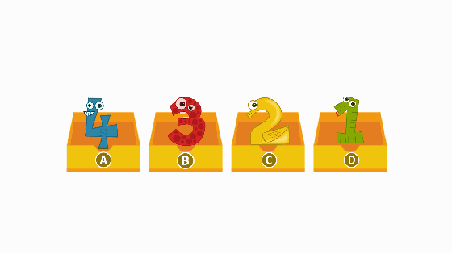

# 一. JavaScript基础


 ### 12-6 预解析
 - 预解析其实就是聊聊 JS 代码的编译和执行
 - JS 是一个解释型语言，就是在代码执行之前，先对代码进行通读和解释，然后再执行代码
 - 也就是说，JS 代码在运行的时候，会经历两个环节，即 **解释代码** 和 **执行代码**
```JavaScript
console.log(myage)
var myname = "Ben"
console.log(myname)
// 报错
```
```JavaScript
console.log(myname)
var myname = "Ben"
console.log(myname)
// undefined
// Ben
```
- 因为是在所有代码执行之前会进行解释代码，所以叫做 **预解析（预解释）**
- 声明式函数：在内存中先声明有一个变量名是函数（整个函数都提到最前面去）
- var 关键字=赋值：在内存中先声明有一个变量名，即先把变量名提到最前面去（执行前只提变量名，不赋值）

> 变量/函数名字重名冲突问题
```JavaScript
var myName = "Bowen"
var myName = "Miles"
console.log(myName)
// Miles
```
```JavaScript
var age = 100
function age() {
    console.log("age is 100")
}
console.log(age)
// 100

这段代码的预解析和执行过程是：
// 预解析：
var age
function age() { }
// 开始执行：
age = 100
console.log(age)
```
```JavaScript
age()
var age = 100
function age() {
    console.log("age is 100")
}
console.log(age)
// age is 100
// 100
```


 ### 12-7 作用域
- **作用域** 就是一个变量可以生效的范围。变量不是在所有地方都可以使用的，而这个变量的使用范围就是作用域
- **全局作用域** 是最大的作用域
- 页面打开的时候，浏览器会自动给我们生成一个全局作用域
- 全局作用域会一直存在，直到页面关闭就销毁了
- **局部作用域** 就是在全局作用域下面有开辟出来的一个相对小一些的作用域
- 在局部作用域中定义的变量只能在这个局部作用域内部使用
- 在 JS 中==只有函数能生成一个局部作用域==，别的都不行
- 每一个函数，都是一个局部作用域
```html
<script>
var myName = "Ben"
function test() {
    console.log(nickName, myName)
    var nickName = "xiaoming"
    console.log("test", nickName)
}
console.log(nickName)
</script>
<script>
console.log(myName)
test()
</script>
<!-- Error: nickName is not defined
Ben
undefined 'Ben'
test xiaoming -->
```
#### 访问规则

- 当想获取一个变量的值的时候，我们管这个行为叫做 **访问**
- 获取变量的规则：
    - 首先，在自己的作用域内部查找，如果有，就直接拿来使用；如果没有，就去上一级作用域查找，如果有，就拿来使用；如果没有，就继续去上一级作用域查找，依次类推
    - 如果一直到全局作用域都没有这个变量，那么就会直接报错（该变量 is not defined）
    - 变量的访问规则也叫做 **作用域的查找机制**
    - 作用域的查找机制只能是向上一级找，不能向下找

#### 赋值规则

- 当想给一个变量赋值的时候，那么就先要找到这个变量，再给他赋值
- 变量赋值规则：
    - 先在自己作用域内部查找，有就直接赋值；没有就去上一级作用域内部查找，有就直接赋值；还没有再去上一级作用域查找，有就直接赋值
    - 如果一直找到全局作用域都没有，那么就把这个变量定义为全局变量，再给他赋值

## 13. 对象
- 对象是一个复杂数据类型
- 其实说是复杂，但是没有很复杂，只不过是存储了一些基本数据类型的一个集合
```javascript
var obj = {
  num: 100,
  str: 'hello world',
  boo: true
}
```
- 这里的 {} 和函数中的 {} 不一样。函数里面的是写代码的，而对象里面是写一些数据的
- 对象就是一个键值对的集合
- {} 里面的每一个键都是一个成员
- 也就是说，我们可以把一些数据放在一个对象里面，那么他们就互不干扰了

> 其实就是我们准备一个房子，把我们想要的数据放进去，然后把房子的地址给到变量名，当我们需要某一个数据的时候，就可以根据变量名里面存储的地址找到对应的房子，然后去房子里面找到对应的数据

### 13-1 创建对象
#### (1) 字面量的方式创建一个对象
```javascript
// 创建一个空对象
var obj = {}
// 向对象中添加成员
obj.name = 'Jack'
obj.age = 18
```
#### (2) 内置构造函数的方式创建对象
- JS 内置了一个构造函数Object()，用于创建一个对象使用的
  ==*注意 Object() 要首字母大写*==
```js
// 创建一个空对象
var obj = new Object()
// 向对象中添加成员
obj.name = 'Rose'
obj.age = 20
// console.log(obj)
// {name: 'Rose', age: 20}
```
### 13-2 对象的基本操作

```JS
// 增
var obj = {}
obj.name = "Ben"
obj.age = 30
obj.location = "Melbourne"

//查
document.write("姓名是 + obj.name)

//改
obj.age = 35

// 删
delete obj.name

// 2-增
var obj2 = {}
obj2["name"] = "Bowen"

// 2-查
console.log(obj2["name"])

// 2-改
obj2["name"] = "Miles"

// 2-删
delete obj2["name"]
```
### 13-3 对象的遍历
```js
var obj = {
    name: "Ben",
    age: 35,
    location: "Melbourne",
    height: 178,
    weight: 74
}
for (var i in obj) {
    // 获取key
    //console.log(i)
    // 获取value
    //console.log(obj[i]) 
    document.write(i + ":" + obj[i])
    document.write("<br>")
}
```


### 13-4 数据类型之间存储的区别
```js
var obj = {
    name:"Bowen",
    age:100
}
var obj2 = obj
// console.log(obj===obj2)
// true
obj2.name = "Miles"
console.log(obj, obj2)
// {name:"Miles",age:100} {name:"Miles", age:100}
// 把obj存储空间的地址一起复制给了obj2，相当于给了obj2一把复制的钥匙，房间其实没有改变，于是更改obj2房间里的值，就等于是更改了obj房间里的值
```
```js
var obj = {
    name:"Bowen",
    age:100,
    location: "Melbourne"
}
var obj2 = {}
for (var i in obj) {
    obj2[i] = obj[i]
}
obj2.name = "Miles"
console.log(obj, obj2)
// {name:"Miles", age:100, location: Melbourne} {name:"Bowen", age:100, Location: Melbourne}
// 先给obj2建立一个空值，相当于买了个新房子，然后再把obj房子里的东西复制一份放到obj2的新房子里面去

```
- 既然我们区分了基本数据类型和复杂数据类型，那么他们之间就一定会存在一些区别。他们最大的区别就是在存储上的区别。我们的存储空间分成两种 **栈** 和 **堆**
- 栈： 主要存储基本数据类型的内容
- 堆： 主要存储复杂数据类型的内容
  
#### 基本数据类型在内存中的存储情况
- 如var num = 100，在内存中直接在 **栈** 空间内有存储一个数据
#### 复杂数据类型在内存中的存储情况
- 在 **堆** 里面开辟一个存储空间，把数据存储到存储空间内，把存储空间的地址赋值给栈里面的变量。

#### 数据类型之间的比较
- 基本数据类型是 **值** 之间的比较
```js
var num = 1
var str = '1'
console.log(num == str) // true
```
- 复杂数据类型是 **地址** 之间的比较。因为我们创建了两个对象，那么就会在堆空间里面开辟两个存储空间存储数据（两个地址）。虽然存储的内容是一样的，那么也是两个存储空间，两个地址
```js
var obj = { name: 'Jack' }
var obj2 = { name: 'Jack' }
console.log(obj == obj2) // false
```
- 复杂数据类型之间就是地址的比较，所以 obj 和 obj2 两个变量的地址不一样
所以我们得到的就是 false

## 14. 数组
14. 数组
- 数组是一个 **数据的集合** 也就是我们把一些数据放在一个盒子里面，按照顺序排好
```
[1, 2, 3, 'hello', true, false]
```
#### 数据类型分类

number / string / boolean / undefined / null / object / function / array / …

- 数组也是数据类型中的一种

- 我们简单的把所有数据类型分为两个大类 **基本数据类型** 和 **复杂数据类型**

- **基本数据类型**： number / string / boolean / undefined / null

- **复杂数据类型**： object / function / array / …

### 14-1 创建一个数组
- 数组就是一个 [], 在 [] 里面存储着各种各样的数据，按照顺序依次排好
#### (1) 字面量创建一个数组
- 直接使用 [] 的方式创建一个数组

```js
// 创建一个空数组
var arr1 = []
// 创建一个有内容的数组
var arr2 = [1, 2, 3]
```
#### (2) 内置构造函数创建数组
使用 JS 的内置构造函数 Array 创建一个数组
```js
// 创建一个空数组
var arr1 = new Array()
// 创建一个长度为 10 的数组
var arr2 = new Array(10)
// 创建一个有内容的数组
var arr3 = new Array(1, 2, 3)
```
### 14-2 数组的 length
- length 就是表示数组的长度，数组里面有多少个成员，length 就是多少
```js
// 创建一个数组
var arr = [1, 2, 3]
console.log(arr.length) // 3
```
- length 可读可写，可用于清空数组
```js
var arr1 = [1,2,3,4,8]
arr1.length = 3
console.log(arr1) // [1,2,3]
arr1.length = 0
console.log(arr1) // []
```
var arr2 = ["Bowen","Benjamin","Miles"]
### 14-3 数组的索引
- **索引**，也叫做下标，是指一个数据在数组里面排在第几个的位置

注意： ==在所有的语言里面，索引都是从 0 开始的==。在 JS 里面也一样，数组的索引从 0 开始
- 想获取数组中的第几个就使用 数组[索引] 来获取
```javascript
var arr = ['hello', 'world']
console.log(arr[0]) // hello
console.log(arr[1]) // world
console.log(arr[2]) // undefined
arr[0] = "Ben"
console.log(arr) // ['Ben','World']
arr[2] = "Bowen" 
console.log(arr) // ['Ben','World','Bowen']
```
 ### 14-4 数组的遍历
 ```javascript
 var arr3 =[3,4,5,6,7,8]
 for (var i=0; i<arr3.length; i++) {    
    console.log(arr3[i])
 } 
 ```
### 14-5 数组的复制
```javascript
var arr = [3,4,5,6]
var arr1 = arr // 相当于配了把钥匙，房间没变
arr1[0] = 1
console.log(arr1) // [1,4,5,6]
console.log(arr) // [1,4,5,6] 

var arr2 = [] // 开了间新房
for (var i=0; i<arr.length; i++) {
    arr2[i] = arr[i] 
}                      // 买了和arr一模一样的一套家具
arr2[0] = 7            // arr2换家具不影响arr
console.log(arr2,arr1) // [7,4,5,6] [1,4,5,6]
```
### 14-6 数组的排序
- 排序，就是把一个乱序的数组，通过我们的处理，让他变成一个有序的数组

#### (1) 冒泡排序
  
 


# 二. BOM


# 三. DOM


# 四. ES6


# 五.面向对象


# 六. AJAX


# 七. swiper


# 八. BootStrap


# 九. Sass


